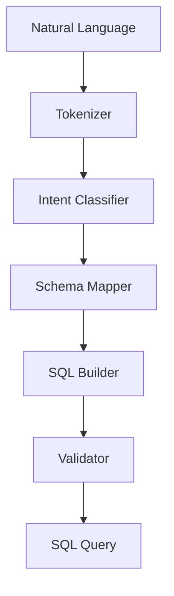

# 🔥 QueryForge

> Natural language to SQL — no LLM required

[](https://github.com/MukundaKatta/QueryForge/actions)
[](LICENSE)
[]()

## What is QueryForge?
QueryForge converts natural language questions into SQL queries using rule-based pattern matching and schema awareness. It handles common query patterns without any LLM API calls, with optional LLM fallback for complex questions.

## ✨ Features
- ✅ Rule-based NL-to-SQL for common patterns
- ✅ Schema-aware query generation
- ✅ Support for SELECT, WHERE, JOIN, GROUP BY, ORDER BY
- ✅ SQL validation and safety checks
- ✅ Multiple dialect support (SQLite, PostgreSQL, MySQL)
- 🔜 LLM fallback for complex queries
- 🔜 Query explanation in plain English

## 🚀 Quick Start
```bash
pip install queryforge
```
```python
from queryforge import QueryEngine, Schema

schema = Schema.from_dict({
    "users": ["id", "name", "email", "created_at"],
    "orders": ["id", "user_id", "total", "status"]
})

engine = QueryEngine(schema)
sql = engine.translate("show me all users who placed orders over $100")
print(sql)
# SELECT users.* FROM users JOIN orders ON users.id = orders.user_id WHERE orders.total > 100
```

## 🏗️ Architecture


## 📖 Inspired By
Inspired by text-to-SQL research and tools like SQLCoder, but built as a lightweight rule-based library that works offline.

---
**Built by [Officethree Technologies](https://github.com/MukundaKatta)** | Made with ❤️ and AI
